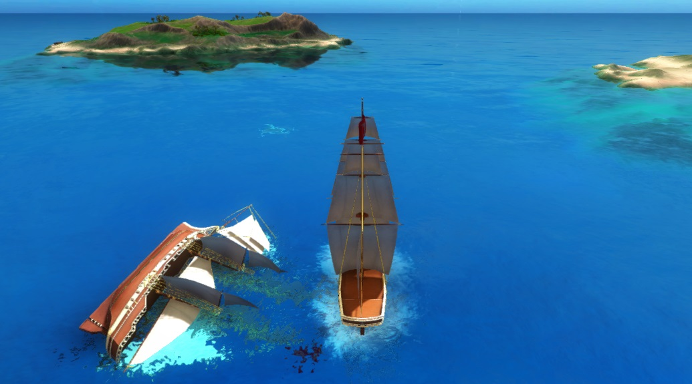

# PiratesTutorial

---

*Copyright (C) 2017 Improbable Worlds Limited. All rights reserved.*

- *Accompanying tutorial*: [https://spatialos.improbable.io/docs/reference/latest/tutorials/pirates/lesson1](https://spatialos.improbable.io/docs/reference/latest/tutorials/pirates/lesson1)

- *GitHub repository*: [github.com/spatialos/PiratesTutorial](https://github.com/spatialos/PiratesTutorial)

---

## Introduction

The PiratesTutorial is a [SpatialOS](https://improbable.io/) project with an implementation of a basic pirates game.

You can follow the [accompanying tutorial](https://spatialos.improbable.io/docs/reference/latest/tutorials/pirates/lesson1) to:
* Learn the concepts underpinning SpatialOS.
* Learn how to set up and use SpatialOS.
* Add new functionality to the game.

To build this project, you will need access to the [SpatialOS SDK](https://spatialos.improbable.io/get-spatialos), and to have set it up on your machine (see the setup guides for [Windows](https://spatialos.improbable.io/docs/reference/latest/setup-spatialos/win) or [Mac](https://spatialos.improbable.io/docs/reference/latest/setup-spatialos/mac)).

If you run into problems, or want to give us feedback, please visit the [SpatialOS forums](https://forums.improbable.io/).

## Prerequisite

Unity 2017.3.0 or above is required to build this project. 
